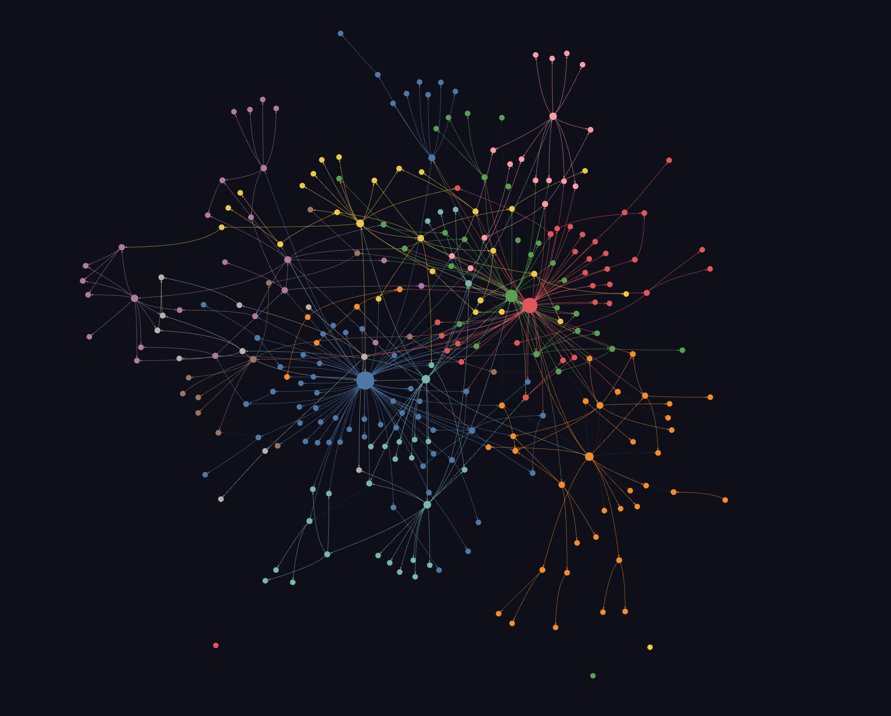

# LTX Wiki

A living knowledge base about [LTX](https://ltx.io) by [Lightricks](https://www.lightricks.com) — the models (LTX-Video, LTX-2, LTX-2.3), the products (LTX Studio, LTX Desktop, LTX API), the architecture, the ecosystem, and the competitive landscape. Clone it, open it in [Claude Code](https://docs.anthropic.com/en/docs/claude-code), and talk to it.

## What you can do

```bash
# Ask anything — get cited answers from 213 wiki pages
/wiki-query How does LTX-2's audio-video sync work?
/wiki-query What changed architecturally from LTX-Video to LTX-2?
/wiki-query Compare LTX-2.3 vs Wan 2.2 — speed, quality, audio
/wiki-query What VRAM do I need to run LTX-2.3 locally?
/wiki-query How does the 1:192 VAE compression ratio work and why is it significant?
/wiki-query What IC-LoRA control types are available and how do they differ?
/wiki-query What happened to Sora and what does it mean for LTX?
/wiki-query Which cloud providers host LTX models and how do they compare on pricing?
/wiki-query What papers cite LTX-Video and what do they use it for?
/wiki-query How does the community rank open-source video models in 2026?

# Research a new topic — Claude searches the web, saves sources to raw/
/wiki-research LTX Video 3.0 announcements

# Ingest new sources — turns raw files into cross-linked wiki pages
/wiki-ingest

# Lint the wiki — finds contradictions, orphans, broken links, gaps
/wiki-lint

# Build a knowledge graph from all sources
/graphify ./raw
```

That's the idea: you ask questions, add sources, and the wiki grows. The LLM handles all the summarization, cross-referencing, and bookkeeping.

### Setup

```bash
git clone https://github.com/Beckdotan/ltx-wiki.git
cd ltx-wiki

# Optional: install graphify for knowledge graph
pip install graphifyy

# Open with Claude Code — skills are auto-detected
claude
```

## Knowledge graph



284 nodes, 418 edges, 16 communities. Open `graphify-out/graph.html` in any browser — no server needed. Click nodes, search concepts, filter by community.

## What's inside

| | Count | Description |
|---|---|---|
| **Raw sources** | 239 files | Research from web, GitHub, HuggingFace, Reddit, arXiv, blogs |
| **Wiki pages** | 213 pages | Structured, cross-linked markdown with `[[wikilinks]]` |
| **Knowledge graph** | 284 nodes, 418 edges | Interactive HTML visualization via [graphify](https://github.com/safishamsi/graphify) |

### Topics covered

- LTX-Video model versions (0.9.0 through 0.9.8) and LTX-2/2.3
- Architecture deep dives (Video-VAE, DiT transformer, 1:192 compression)
- 6 Lightricks research papers (LTX-Video, LTX-2, AVControl, CAFA, Just-Dub-It, ID-LoRA)
- Official REST API, pricing, and developer docs
- Inference providers (fal.ai, Replicate, Segmind, WaveSpeed, Modal, RunPod)
- Python/Diffusers integration and ComfyUI workflows
- LoRA training, fine-tuning, and IC-LoRA control
- Community projects, adoption metrics, and social media sentiment
- Model competitors (Wan, HunyuanVideo, CogVideo, Mochi, Open-Sora)
- Product competitors (Runway, Pika, Kling, Sora, Luma, Veo)
- Lightricks company, LTX Studio, LTX Desktop, ecosystem

## How it works

Built on the [Karpathy LLM Wiki pattern](https://gist.github.com/karpathy/442a6bf555914893e9891c11519de94f):

```
Human adds sources -> LLM ingests -> Wiki pages grow -> Human queries -> Answers compound
```

Three layers:

1. **`raw/`** — Immutable source documents. The LLM reads but never modifies these.
2. **`wiki/`** — LLM-generated pages with `[[wikilinks]]`, YAML frontmatter, and cross-references.
3. **`CLAUDE.md`** — Schema defining conventions, workflows, and structure rules.

The wiki is a **persistent, compounding artifact**. Every new source and every good question makes it richer.

### Also works with Obsidian

Open the `wiki/` folder as an [Obsidian](https://obsidian.md/) vault for graph view and `[[wikilink]]` navigation. Start from `wiki/index.md`.

## Contributing

1. Save a markdown file to `raw/` (articles, papers, notes — anything text)
2. Run `/wiki-ingest` in Claude Code
3. The LLM creates/updates wiki pages, updates the index, and logs the operation

Run `/wiki-lint` periodically to catch issues.

## License

The wiki content is generated from publicly available sources. See individual raw files for source URLs and attribution.

## Credits

- Wiki pattern by [Andrej Karpathy](https://gist.github.com/karpathy/442a6bf555914893e9891c11519de94f)
- Knowledge graph by [graphify](https://github.com/safishamsi/graphify)
- Built with [Claude Code](https://docs.anthropic.com/en/docs/claude-code) by Anthropic
